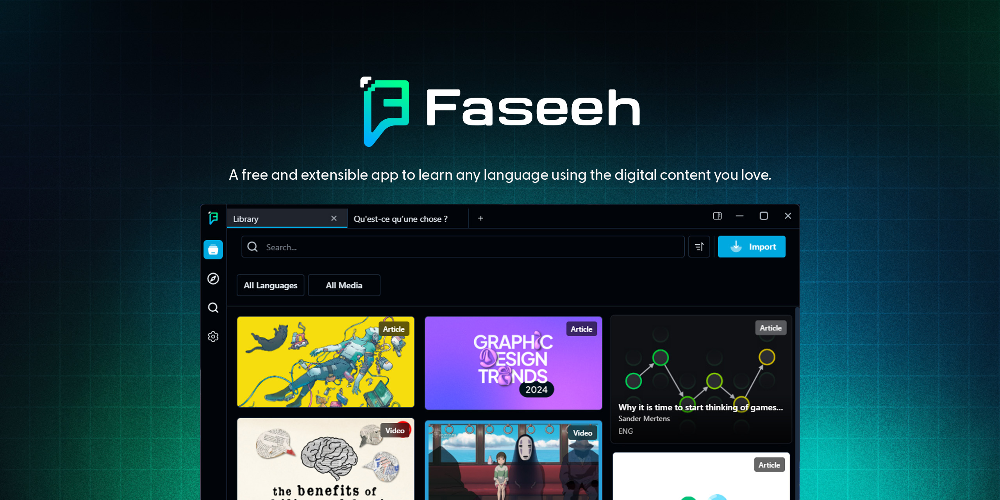
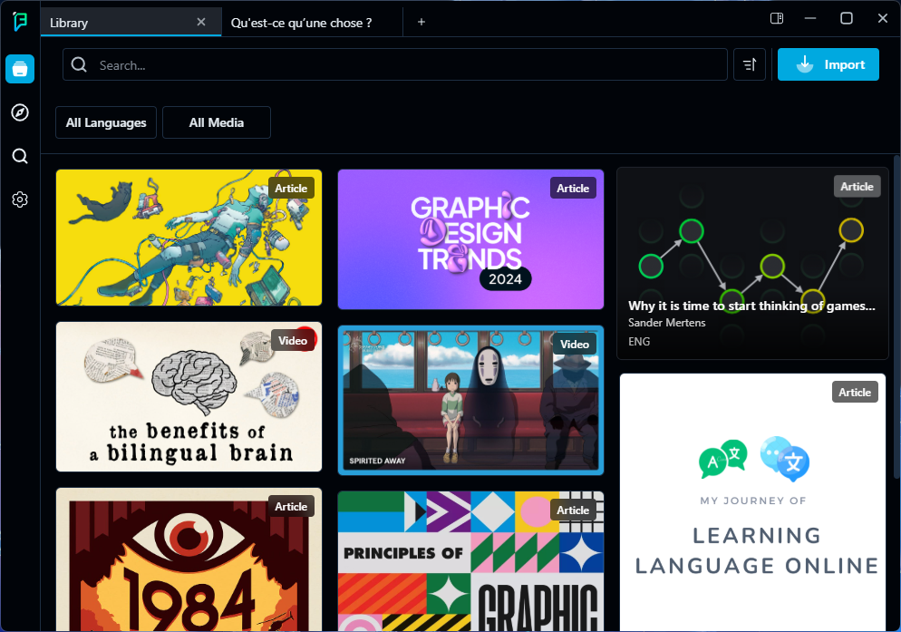
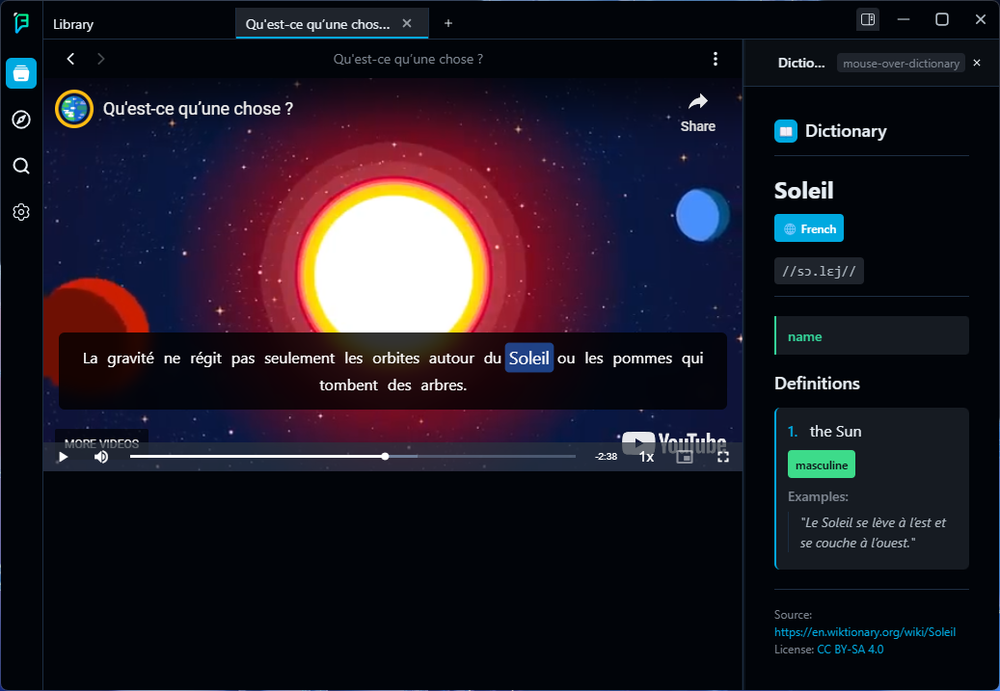
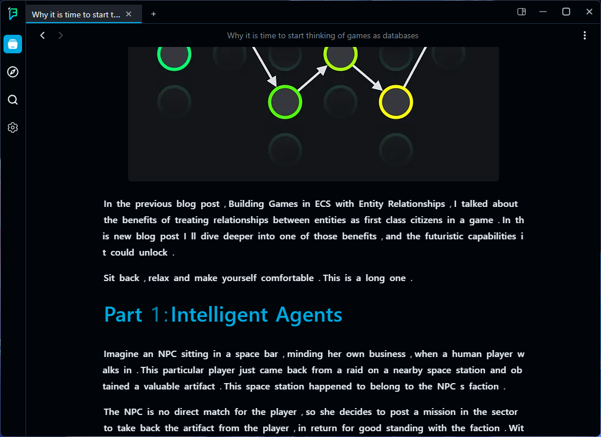
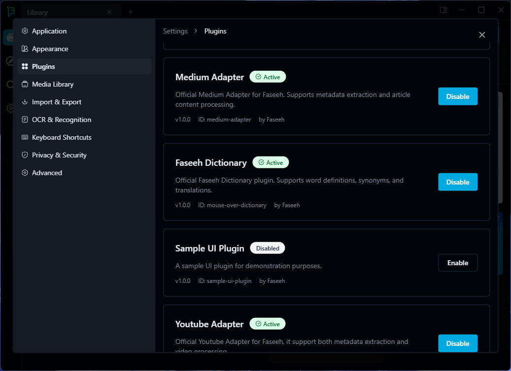
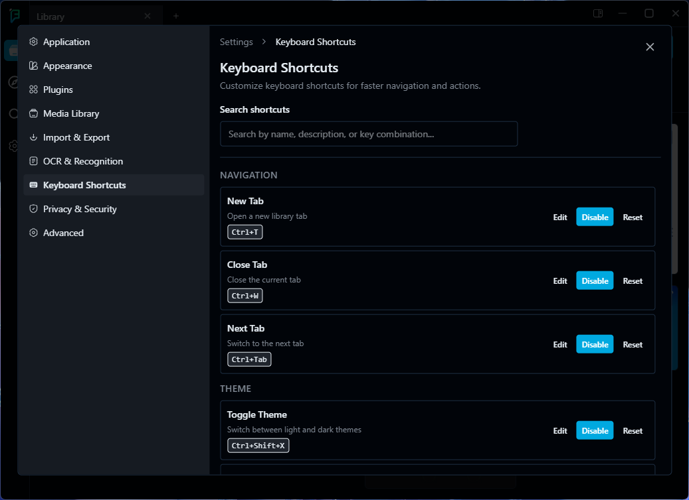

# Faseeh - Language Learning Toolkit



<p align="center">
  
  
  
  
</p>

Faseeh is a desktop language learning toolkit that turns content you love—videos, articles, and books—into your personal study material. It's designed for the self-driven learner who is tired of generic lessons and wants to immerse themselves in authentic content.

Instead of juggling multiple applications, Faseeh provides a unified **framework** to bring learning tools together. It creates a cohesive, distraction-free environment where functionality, delivered via plugins, can work in harmony.

> ⚠️ **Please Note:** This project is in its early development stages. The core framework and interfaces shown below are a functional proof of concept. The true power of Faseeh is realized through its plugin system, which is ready for future expansion.

## ✨ Key Features

- **Import from Web or Local Files:** Add learning material by pasting a URL or selecting files directly from your computer.
- **Custom Media Viewers:** Plugins can define entirely new viewers for different media types, allowing for unique interfaces beyond the default text and media players.
- **Powerful Plugin System:** A built-in manager lets you enable or disable plugins to add new functionalities, from content adapters to dictionaries.
- **Language-Agnostic Core:** The base app provides the framework; plugins provide the language-specific tools.
- **Fully Customizable:** Tailor your experience with settings for appearance, keyboard shortcuts, and plugin configurations.
- **Private & Local-First:** All your data, content, and progress are stored securely on your own machine.

## 📸 Application Screenshots

<table cellpadding="15" cellspacing="0" style="border: none;">
  <tr>
    <td width="30%" valign="top">
      <strong>Your Central Library</strong>
      <p>The main dashboard where all your imported learning materials live. Content is displayed with rich metadata and can be easily searched and filtered.</p>
    </td>
    <td width="70%">
      
    </td>
  </tr>
  <tr>
    <td width="30%" valign="top">
      <strong>Interactive Video Player</strong>
      <p>Learn in context. The core app makes content interactive, enabling plugins to inject contextual tools. This allows for rich, in-the-moment exploration—such as definitions, translations, explanations, and more.</p>
    </td>
    <td width="70%">
      
    </td>
  </tr>
    <tr>
    <td width="30%" valign="top">
      <strong>Distraction-Free Text Reader</strong>
      <p>A clean, readable interface for articles and e-books. Like the video player, text is interactive, creating a powerful environment for reading-based study.</p>
    </td>
    <td width="70%">
      
    </td>
  </tr>
  <tr>
    <td width="30%" valign="top">
      <strong>Extensible via Plugins</strong>
      <p>A built-in interface to enable or disable plugins. Faseeh's core functionality is built to be expanded by the community through adapters, dictionaries, and more.</p>
    </td>
    <td width="70%">
      
    </td>
  </tr>
  <tr>
    <td width="30%" valign="top">
      <strong>Full Customization</strong>
      <p>Fine-tune your experience with a deep settings menu, including appearance, import/export options, and customizable keyboard shortcuts for power users.</p>
    </td>
    <td width="70%">
      
    </td>
  </tr>
</table>

## 🚀 Getting Started

To get a local copy up and running, follow these simple steps.

### Prerequisites

- Node.js and npm installed.

### Installation

1.  **Clone the repository:**
    ```sh
    git clone https://github.com/FaseehApp/Faseeh.git
    cd Faseeh
    ```
2.  **Install dependencies:**
    ```sh
    npm install
    ```
3.  **Run the app in development mode:**
    ```sh
    npm run dev
    ```

## 📦 Build for Production

```sh
# For Windows
npm run build:win

# For macOS
npm run build:mac

# For Linux
npm run build:linux
```

## 📜 License

This project is licensed under the MIT License. See [LICENSE](LICENSE) for details.
